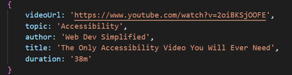

## Video Docs App
___

### VideoDocs App, leading to YT videos on topics of your interests.

### **[Live DEMO](https://sinisavukmirovic.github.io/VideoDocs-App/)**

___

#### To customise the App with your own VideoDocs topics, just edit the "videoDocs.js" file in "data" folder. 

##### Where "videoURL" should be a link to the YT video or playlist of your choice
##### "topic" should be the topic Video Doc is about and that will be displayed in the topics list
##### "author" the YT channel name of which the video is from
##### "title" the title of the video
##### "duration" the duration of the YT video
___

#### Had problems with set height on main element, but having the panel element displayed as grid. CSS "grid-auto-rows" proprerty seemed to fixed it [about grid auto rows](https://developer.mozilla.org/en-US/docs/Web/CSS/grid-auto-rows)

#### Shuffling functionality [More about Shuffling](https://www.freecodecamp.org/news/how-to-shuffle-an-array-of-items-using-javascript-or-typescript/)

#### Found out that "hidden" attribute is not working on elements that are displayed as grid or flex...

#### Learned about "has attribute" method in JS [hasAttribute() method](https://developer.mozilla.org/en-US/docs/Web/API/Element/hasAttribute)

##### Trying to use custom mouse cursor crashes the app on Chrome for some reason... UPDATE: started working a few days later by spplying that property through JS NEW UPDATE: doesn't work when hosted on GH pages?! Image not getting loaded...?!